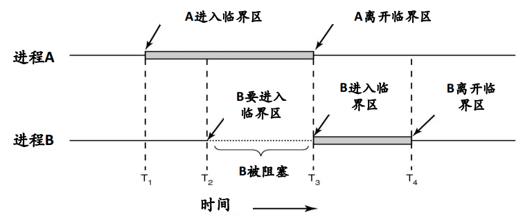
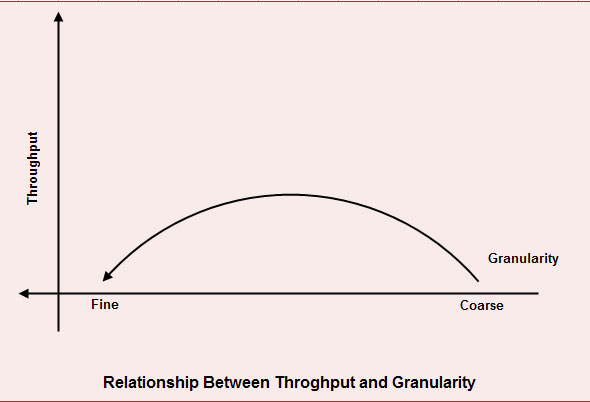

## 当我们谈论锁，我们谈什么

再说锁之前，需要先说一下进程间通信。

### 1. 进程间通信（Inter Process Communication, IPC）

**竞争条件**

多个进程（线程）通过共享内存（或者共享文件）的方式进行通信就会出现竞争条件。竞争条件的意思是说两个或者多个进程读写某些共享数据，而最后的结果取决于进程运行的精确时序。下面用一个golang程序来模拟一下。


```go
package main

import (
    "fmt"
    "runtime"
    "sync"
)

func main() {
    a := 1
    var wg sync.WaitGroup

    wg.Add(2)
    go func() {         //goroutine1
        defer wg.Done()
        a = a + 1
    }()

    go func() {         //goroutine2
        defer wg.Done()
        if a==1 {
            runtime.Gosched()
            fmt.Println("a==",a)
        }
    }()

    runtime.Gosched()
    wg.Wait()
}
```

在这里起了两个goroutine来模拟线程，使用runtime.Gosched()来手动切换。goroutine1对a进行+1操作，goroutine2对a进行判断然后进行操作。如果goroutine2对a判断完进行操作的时候，goroutine1对a进行操作就会出问题。上面代码模拟的就是这种情况。举个栗子，火车站卖票。卖票前先检查有没有余票，假设现在还有一张余票，就在出票的时候另外一个窗口把票卖了，这个时候就会出票失败。

**临界区**

我们可以简单地把程序代码分成两部分：不会导致竞争条件的程序片段和会导致竞争条件的程序片段。会导致竞争条件的程序片段就叫做临界区。避免竞争条件只需要阻止多个进程同时读写共享的数据就可以了，也就是保证同时只有一个进程处于临界区内。

我们可以用《现代操作系统》一书的配图来理解。



### 2. 锁是什么

    In computer science, a lock or mutex (from mutual exclusion) is a synchronization mechanism for enforcing limits on access to a resource in an environment where there are many threads of execution. A lock is designed to enforce a mutual exclusion concurrency control policy.

上面摘自维基百科。简单地来说，锁就是保证只有一个进程处于临界区一种机制。

#### 1.操作系统的锁

**硬件**

对于单处理器而言，临界区问题好解决：修改共享变量时禁止中断出现。但是屏蔽中断后，时钟中断也会被屏蔽。相当于这个时候我们把CPU交给了这个进程，他不会因为CPU时钟走完而切换，如果其不再打开中断，后果将是非常可怕的。总之，把屏蔽中断的权力交给用户级进程是很不明智的。

对于多处理器而言，屏蔽中断只会对执行了中断指令的那个CPU有效，但是其他CPU还是有可能会改变共享内存中的数据的。许多现代计算机系统都提供了特殊硬件指令以允许能原子地（不可中断地）检查和修改字的内容或交换两个字的内容（比如CAS，compare and swap）。其实很多锁的软件方案都是通过调用原子操作来实现的。

**软件**

信号量。信号量是E. W. Dijkstra在1965年提出的一种方法，它使用一个整型变量来累计唤醒次数。一个信号量的取值可以为0（表示没有保存下来的唤醒次数）或者为正值（表示有一个或者多个唤醒操作）。信号量除了初始化外只能通过两个标准原子操作：wait()和signal()来访问。这些操作原来被称为P（荷兰语Proberen，测试）和V（荷兰语Verhogen，增加）。wait()和signal()的定义可表示如下：

```go
wait(S) {
    while(S<=0)
        ;   //no-op
    S--
}

signal(S) {
    S++
}
```

这里需要注意的是，在wait()和signal()操作中，对信号量整型值的修改必须不可分地执行。另外对于wait(S)，对S的整型值的测试（S<=0）和对其可能的修改(S–)，也必须不被中断地执行。

**互斥量。**

互斥量可以认为是取值只有0和1的信号量。我们经常使用就是这个。使用其来同步的代码如下


```go
do {
    waiting(mutex);
        //critical section
    signal(mutex);
        //remainder section
}while(TRUE)
```

**实现。**

每个信号量关联一个等待进程链表。进程wait()的时候发现信号量不为正时，可以选择忙等待（信号量那儿的例子），也可以选择阻塞自己（下面的实现），进程加入等待链表。signal()时从等待链表中取出进程唤醒。

```c
typedef struct {
    int value;
    struct process *list;
} semaphore;

wait(semaphore *S) {
    S->value--;
    if (S->value < 0) {
        add this process to S->list;
        block()
    }
}

signal(semphore *S) {
    S->value++;
    if (S->value <=0 ) {
        remove a process P from S->list;
        wakeup(P)
    }
}
```

### 2.锁的种类

根据表现形式，常见的锁有互斥锁、自旋锁、读写锁。

**互斥锁。** 只有取得互斥锁的进程才能进入临界区，无论读写。

**自旋锁。** 自旋锁是指在进程试图取得锁失败的时候选择忙等待而不是阻塞自己。选择忙等待的优点在于如果该进程在其自身的CPU时间片内拿到锁（说明锁占用时间都比较短），则相比阻塞少了上下文切换。注意这里还有一个隐藏条件：多处理器。因为单个处理器的情况下，由于当前自旋进程占用着CPU，持有锁的进程只有等待自旋进程耗尽CPU时间才有机会执行，这样CPU就空转了。

**读写锁。** 读写锁要根据进程进入临界区的具体行为（读，写）来决定锁的占用情况。这样锁的状态就有三种了：读模式加锁、写模式加锁、无锁。

1. 无锁。读/写进程都可以进入。
2. 读模式锁。读进程可以进入。写进程不可以进入。
3. 写模式锁。读/写进程都不可以进入。

### 3.为什么说锁慢？

我们写一个简单的go的性能测试用例如下，使用的是go提供的互斥锁。

```go
package test

import (
    "testing"
    "sync"
)

func Foo1() {
    i:=0;
    i++
}

func Foo2() {
    lock := new(sync.Mutex)
    i:=0
    lock.Lock()
    i++
    lock.Unlock()
}

func BenchmarkFoo1(b *testing.B) {
    for i:=0; i<b.N; i++ {
        Foo1()
    }
}

func BenchmarkFoo2(b *testing.B) {
    for i:=0; i<b.N; i++ {
        Foo2()
    }
}
```

运行


```shell
$ go test -bench='.' lock_test.go
testing: warning: no tests to run
BenchmarkFoo1-8     2000000000           0.30 ns/op
BenchmarkFoo2-8     50000000            35.7 ns/op
PASS
ok      command-line-arguments  2.471s
```

看上去加锁比不加锁慢了两个数量级，在golang中加一次锁耗时大概在20~30ns。但是这并不能说明加锁慢，只能说明加锁和内存操作相比慢很多。那为什么在实际开发中，特别是多线程程序，加了锁之后程序慢了很多呢？

比如我用go1.7做的一个测试，就不贴出来了。golang中的channel底层实现就是用的锁，单个goroutine对channel进行写操作一秒钟可以达到几千万次，而goroutine数量多起来之后性能直线下降。没错，锁竞争慢。

关于锁竞争慢，可以参考这篇文章:[Locks Aren’t Slow; Lock Contention Is](http://preshing.com/20111118/locks-arent-slow-lock-contention-is/)。简短来说，频繁的锁竞争会导致CPU core中的进程上下文切换，同时还有缓存的失效。

### 4.锁的粒度

关于锁的粒度，用下面一张图来表示比较直观:不可过细也不可过糙。




在各种大会上，我们经常会听到演讲者说锁应该是关联数据的，粒度要尽可能的小。但是实际上粒度过小对于代码的效率真的很有影响。比如下面代码片段。

```python
//too-fine granularity
for condition
    momery ops
    lock
    data access
    unlock
end

//more throughput
lock
for condition
    momery ops
    data access
end
unlock
```

锁的粒度一直是一个需要考虑和折中的问题。

[下一篇文章](http://legendtkl.com/2016/10/23/golang-mutex/)会以golang中锁为例子讲讲互斥锁和读写锁的具体实现。

### 参考：

*   《现代操作系统》
*   《操作系统概念》
*   [lock-wikipedia](https://en.wikipedia.org/wiki/Lock_(computer_science))
*   [Read/write lock](https://en.wikipedia.org/wiki/Readers–writer_lock)
*   [Mutual exclusion](https://en.wikipedia.org/wiki/Mutual_exclusion)
*   [Semaphore(programming)](https://en.wikipedia.org/wiki/Semaphore_(programming))
*   [lock granularity](http://ecomputernotes.com/database-system/rdbms/lock-granularity)

#

    作者：legendtkl
    链接：http://legendtkl.com/2016/10/13/about-lock/
    著作权归作者所有。商业转载请联系作者获得授权，非商业转载请注明出处。


