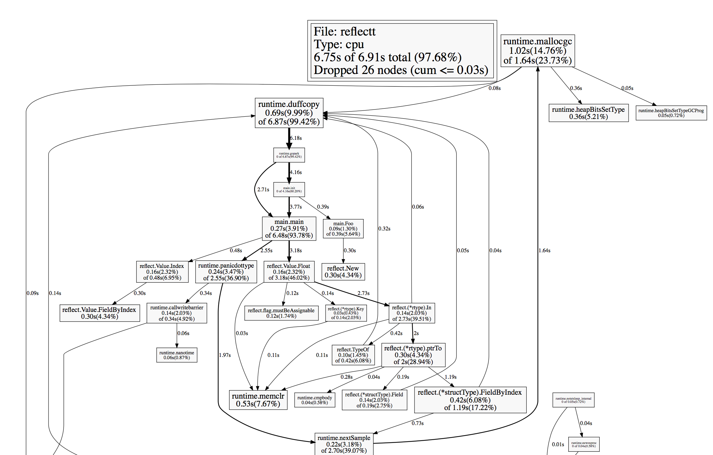

## reflect为什么慢

在上一篇[《reflect实践与剖析》](http://legendtkl.com/2016/08/03/go-reflect-value/)的文章中，本来打算写的更深入一点，结果发现reflect里面的东西太多了，在一篇文章中很难写全，就草草收尾了。今天谈一谈关于reflect的另一个问题：reflect为什么慢？

先问是不是，再问为什么。我们先来看一下reflect是不是真的慢。

### 1. Golang testing

golang提供了一个testing包，使得单元测试、性能测试尤为简单。只要新建一个以_test结尾的文件，然后使用命令go test就可以自动执行文件中的相应测试函数了（单元测试函数以Test开头，性能测试函数以Benchmark开头）。除了单元测试和性能测试，testing还有其他的功能，暂且按住不表。下面主要介绍一下单元测试和性能测试怎么写。

#### 1.1 单元测试

比如我们写了一个简单的浮点数除法函数并编写单元测试。

```go
//浮点除法函数: division.go
func Division(a, b float64) (float64, error) {
  	return a/b, nil
}
//单元测试: division_test.go
func TestDivision(t *testing.T) {
    if i, e := Division(9.3, 3); i!=3.1 || e!= nil {
        t.Error("Division Normal Test Failed")
    } else if i, e:= Division(1,0); i!=0 || e.Error()!="divisor can't be 0"{
        t.Error("Division divisor=0 test Failed")
    } else {
        t.Log("Division Test Failed")
    }
}
```

执行使用`go test filename_test.go`，对`filename_test.go`文件进行测试，如果不加文件，则运行当前目录下的所有已_test结尾的文件。为了便于测试Division函数特意没有考虑除数为0的情况。测试结果如下。

```shell
--> gotest $ go test division_test.go
--- FAIL: TestDivision (0.00s)
		division_test.go:19: Division divisor=0 test Failed
FAIL
```

完善Division函数如下，再运行显示`ok`。

```go
func Division(a, b float64) (float64, error){
    if b == 0 {
        return 0, fmt.Errorf("divisor can't be 0")
    }
    return a/b, nil
}
```

#### 1.2性能测试

还是对于上面的Division函数，编写性能测试函数如下。

```go
func BenchmarkDivision(b *testing.B) {
    for i:=0; i<b.N; i++ {
        Division(3,1)
    }
}
```

性能测试的时候需要加一个`-bench`参数，对于我们这个例子使用`go test -bench='.' division_test.go`即可，执行结果如下：

```shell
PASS
BenchmarkDivision-8		500000000		3.07 ns/op
ok
```

中间一行的意思是执行了5亿次，每次耗时3.07纳秒。

### 2. Reflect Benchmark 测试

我们使用golang testing来做一下reflect的最简单的性能测试。

```go
import (
    "testing"
    "reflect"
)

type Bench struct {
    A int
}

func Foo1(b Bench) {
    _ = Bench{}
}

func Foo2(x interface{}) {
    _ = reflect.ValueOf(x)
}

func BenchmarkFoo1(b *testing.B) {
    var x Bench
    for i:=0; i<b.N; i++ {
        Foo1(x)
    }
}

func BenchmarkFoo2(b *testing.B) {
    var x Bench
    for i := 0; i<b.N; i++ {
        Foo2()
    }
}
```

运行`go test -bench='.'`，结果如下

```shell
PASS
BenchmarkFoo1-8	200000000		0.47 ns/op
BenchmarkFoo2-8	3000000			36.7 ns/op
```

比较来看差距确实比较大啊，当然如果单纯从时间角度来看感觉还好。我们来看一下reflect的源码，试着分析一下时间都浪费在了什么地方。

```go
func ValueOf(i interface{}) Value {
    if i == nil {
        return Value{}
    }
    escapes(i)	//异常处理，先不用管

    return unpackEface(i)
}

func unpackEface(i interface{}) Value {
    e := (*emptyInterface)(unsafe.Pointer(&i))
    t := e.typ
    if t == nil {
        return Value{}
    }
    f := flag(t.Kind())
    if ifaceIndir(t) {
        f |= flagIndir
    }
    return Value{t, e.word, f}
}
```

`ValueOf`的工作是将built-in类型或者自定义类型（比如struct）转换成reflect包中的Value Struct，看上去耗时的地方应该就是最后面的内存分配了。为了验证想法，可以做一下CPU Profiling

### 3. Golang Profiling

golang提供了一套工具pprof用来做性能分析与优化，主要分为两种：memory使用情况和CPU使用情况。关于pprof的具体使用这里就不细说，后面会把他和gcvis放在一起再说一下。为了做profiling，需要在原程序插入一些代码，主要是做采集用的，代码如下，插入的代码已经标记出来了。

```go
import (
    "flag"
    "fmt"
    "os"
    "reflect"
    "runtime/pprof"
)

type Kltao struct {
    Age	int
}

func Foo(k interface{}) {
    _ = reflect.ValueOf(k)
}
var cpuprofile = flag.String("cpuprofile", "", "write cpu profile to file")

func main() {
    flag.Parse()

    if *cpuprofile != "" {
        f, err := os.Create(*cpuprofile)
        if err != nil {
            fmt.Println(err)
        }
        pprof.StartCPUProfile(f)
        defer pprof.StopCPUProfile()
    }

    for i:=0; i<50000000; i++ {
        var k Kltao
        Foo(k)
    }
}
```

运行。

```shell
$ go build reflectt.go
$ ./reflectt cpuprofile=reflect.prof
$ go tool pprof reflectt reflect.prof
Entering interactive mode (type "help" for command)
(pprof) web
```

输入web之后将会通过浏览器打开各个函数的开销图，如下。



看了上图我只想说，这个真不是我想象的那么简单，这个图真是看的脑袋疼。仔细分析之后可以得到一个大概结论，reflect慢主要有两个原因：一是涉及到内存分配以后GC；二是reflect实现里面有大量的枚举，也就是for循环，比如类型之类的。

### 4. 其他Benchmark Test

上面的测试太简单了，可能会有以偏概全的嫌疑，羡慕提供了一个函数调用的性能测试，profiling图我先自己研究研究。


```go
package test

import (
    "testing"
    "reflect"
)

type Kltao struct {
//	Name string
    Age  int
//	B    int
//	C    int
//	D    int
}

func (k Kltao) Foo() {
    for i := 0; i < 10000; i++ {
        k.Age++
    }
}
func (k Kltao) Foo1() {
    for i := 0; i < 10000; i++ {
        k.Age++
    }
}

func (k Kltao) Foo2() {
    for i := 0; i < 1000000; i++ {
        k.Age++
    }
}
func (k Kltao) Foo3() {
    for i := 0; i < 10000; i++ {
        k.Age++
    }
}
func SimpleFoo(kltao Kltao) {
    kltao.Foo1()
}
func ReflectFoo(k interface{}) {
    v := reflect.ValueOf(k)
    foo := v.MethodByName("Foo1")
    foo.Call(nil)
}

func BenchmarkSimpleFoo(b *testing.B) {
    var kltao Kltao
    for i := 0; i < b.N; i++ {
        SimpleFoo(kltao)
    }
}

func BenchmarkReflectFoo(b *testing.B) {
    var kltao Kltao
    for i := 0; i < b.N; i++ {
        ReflectFoo(kltao)
    }
}
```

性能测试结果如下。

```shell
PASS
BenchmarkSimpleFoo-8		500000		3206 ns/op
BenchmarkReflectFoo-8		500000 		3547 ns/op

```

#

    作者：legendtkl
    链接：http://legendtkl.com/2016/08/06/reflect-inside/
    著作权归作者所有。商业转载请联系作者获得授权，非商业转载请注明出处。