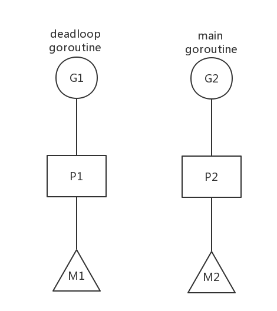
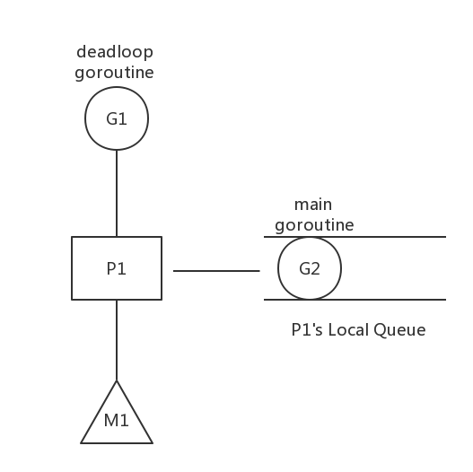

## Goroutine调度实例简要分析


前两天一位网友在微博私信我这样一个问题：

    抱歉打扰您咨询您一个关于Go的问题：对于goroutine的概念我是明了的，但很疑惑goroutine的调度问题, 根据《Go语言编程》一书：“当一个任务正在执行时，外部没有办法终止它。
    要进行任务切换，只能通过由该任务自身调用yield()来主动出让CPU使用权。” 那么，假设我的goroutine是一个死循环的话，是否其它goroutine就没有执行的机会呢？
    我测试的结果是这些goroutine会轮流执行。那么除了syscall时会主动出让cpu时间外，我的死循环goroutine 之间是怎么做到切换的呢？

我在第一时间做了回复。不过由于并不了解具体的细节，我在答复中做了一个假定，即假定这位网友的死循环带中没有调用任何可以交出执行权的代码。事后，这位网友在他的回复后道出了死循环goroutine切换的真实原因：他在死循环中调用了fmt.Println。

事后总觉得应该针对这个问题写点什么? 于是就构思了这样一篇文章，旨在循着这位网友的思路通过一些例子来step by step演示如何分析go schedule。如果您对Goroutine的调度完全不了解，那么请先读一读这篇前导文 [《也谈goroutine调度器》](http://tonybai.com/2017/06/23/an-intro-about-goroutine-scheduler/)。

### 一、为何在deadloop的参与下，多个goroutine依旧会轮流执行

我们先来看case1，我们顺着那位网友的思路来构造第一个例子，并回答：“为何在deadloop的参与下，多个goroutine依旧会轮流执行？”这个问题。下面是case1的源码：


```go
//github.com/bigwhite/experiments/go-sched-examples/case1.go
package main

import (
    "fmt"
    "time"
)

func deadloop() {
    for {
    }
}

func main() {
    go deadloop()
    for {
        time.Sleep(time.Second * 1)
        fmt.Println("I got scheduled!")
    }
}
```

在case1.go中，我们启动了两个goroutine，一个是main goroutine，一个是deadloop goroutine。deadloop goroutine顾名思义，其逻辑是一个死循环；而main goroutine为了展示方便，也用了一个“死循环”，并每隔一秒钟打印一条信息。在我的macbook air上运行这个例子（我的机器是两核四线程的，runtime的NumCPU函数返回4）：

``` 
$go run case1.go
I got scheduled!
I got scheduled!
I got scheduled!
... ...
```

从运行结果输出的日志来看，尽管有deadloop goroutine的存在，main goroutine仍然得到了调度。其根本原因在于机器是多核多线程的（硬件线程哦，不是操作系统线程）。Go从1.5版本之后将默认的P的数量改为 = CPU core的数量（实际上还乘以了每个core上硬线程数量），这样case1在启动时创建了不止一个P，我们用一幅图来解释一下：



我们假设deadloop Goroutine被调度与P1上，P1在M1(对应一个os kernel thread)上运行；而main goroutine被调度到P2上，P2在M2上运行，M2对应另外一个os kernel thread，而os kernel threads在操作系统调度层面被调度到物理的CPU core上运行，而我们有多个core，即便deadloop占满一个core，我们还可以在另外一个cpu core上运行P2上的main goroutine，这也是main goroutine得到调度的原因。

Tips: 在mac os上查看你的硬件cpu core数量和硬件线程总数量：

``` 
$sysctl -n machdep.cpu.core_count
2
$sysctl -n machdep.cpu.thread_count
4
```

### 二、如何让deadloop goroutine以外的goroutine无法得到调度？

如果我们非要deadloop goroutine以外的goroutine无法得到调度，我们该如何做呢？一种思路：让Go runtime不要启动那么多P，让所有用户级的goroutines在一个P上被调度。

三种办法：

- 在main函数的最开头处调用runtime.GOMAXPROCS(1)；
- 设置环境变量export GOMAXPROCS=1后再运行程序
- 找一个单核单线程的机器^0^（现在这样的机器太难找了，只能使用云服务器实现）

我们以第一种方法为例：

```go
//github.com/bigwhite/experiments/go-sched-examples/case2.go
package main

import (
    "fmt"
    "runtime"
    "time"
)

func deadloop() {
    for {
    }
}

func main() {
    runtime.GOMAXPROCS(1)
    go deadloop()
    for {
        time.Sleep(time.Second * 1)
        fmt.Println("I got scheduled!")
    }
}
```

运行这个程序后，你会发现main goroutine的”I got scheduled”字样再也无法输出了。这里的调度原理可以用下面图示说明：



deadloop goroutine在P1上被调度，由于deadloop内部逻辑没有给调度器任何抢占的机会，比如：进入runtime.morestack_noctxt。于是即便是sysmon这样的监控goroutine，也仅仅是能给deadloop goroutine的抢占标志位设为true而已。由于deadloop内部没有任何进入调度器代码的机会，Goroutine重新调度始终无法发生。main goroutine只能躺在P1的local queue中徘徊着。

### 三、反转：如何在GOMAXPROCS=1的情况下，让main goroutine得到调度呢？

我们做个反转：如何在GOMAXPROCS=1的情况下，让main goroutine得到调度呢？听说在Go中 “有函数调用，就有了进入调度器代码的机会”，我们来试验一下是否属实。我们在deadloop goroutine的for-loop逻辑中加上一个函数调用：


```go
// github.com/bigwhite/experiments/go-sched-examples/case3.go
package main

import (
    "fmt"
    "runtime"
    "time"
)

func add(a, b int) int {
    return a + b
}

func deadloop() {
    for {
        add(3, 5)
    }
}

func main() {
    runtime.GOMAXPROCS(1)
    go deadloop()
    for {
        time.Sleep(time.Second * 1)
        fmt.Println("I got scheduled!")
    }
}
```

我们在deadloop goroutine的for loop中加入了一个add函数调用。我们来运行一下这个程序，看是否能达成我们的目的：

``` 
$ go run case3.go


```

“I got scheduled!”字样依旧没有出现在我们眼前！也就是说main goroutine没有得到调度！为什么呢？其实所谓的“有函数调用，就有了进入调度器代码的机会”，实际上是go compiler在函数的入口处插入了一个runtime的函数调用：runtime.morestack_noctxt。这个函数会检查是否扩容连续栈，并进入抢占调度的逻辑中。一旦所在goroutine被置为可被抢占的，那么抢占调度代码就会剥夺该Goroutine的执行权，将其让给其他goroutine。但是上面代码为什么没有实现这一点呢？我们需要在汇编层次看看go compiler生成的代码是什么样子的。

查看Go程序的汇编代码有许多种方法：

- 使用objdump工具：objdump -S go-binary
- 使用gdb disassemble
- 构建go程序同时生成汇编代码文件：go build -gcflags ‘-S’ xx.go > xx.s 2>&1
- 将Go代码编译成汇编代码：go tool compile -S xx.go > xx.s
- 使用go tool工具反编译Go程序：go tool objdump -S go-binary > xx.s

我们这里使用最后一种方法：利用go tool objdump反编译(并结合其他输出的汇编形式)：

``` 
$go build -o case3 case3.go
$go tool objdump -S case3 > case3.s
```

打开case3.s，搜索main.add，我们居然找不到这个函数的汇编代码，而main.deadloop的定义如下：

``` 
TEXT main.deadloop(SB) github.com/bigwhite/experiments/go-sched-examples/case3.go
        for {
  0x1093a10             ebfe                    JMP main.deadloop(SB)

  0x1093a12             cc                      INT $0x3
  0x1093a13             cc                      INT $0x3
  0x1093a14             cc                      INT $0x3
  0x1093a15             cc                      INT $0x3
   ... ...
  0x1093a1f             cc                      INT $0x3
  
```

我们看到deadloop中对add的调用也消失了。这显然是go compiler执行生成代码优化的结果，因为add的调用对deadloop的行为结果没有任何影响。我们关闭优化再来试试：

``` 
$go build -gcflags '-N -l' -o case3-unoptimized case3.go
$go tool objdump -S case3-unoptimized > case3-unoptimized.s

```

打开 case3-unoptimized.s查找main.add，这回我们找到了它：

``` 
TEXT main.add(SB) github.com/bigwhite/experiments/go-sched-examples/case3.go
func add(a, b int) int {
  0x1093a10             48c744241800000000      MOVQ $0x0, 0x18(SP)
        return a + b
  0x1093a19             488b442408              MOVQ 0x8(SP), AX
  0x1093a1e             4803442410              ADDQ 0x10(SP), AX
  0x1093a23             4889442418              MOVQ AX, 0x18(SP)
  0x1093a28             c3                      RET

  0x1093a29             cc                      INT $0x3
... ...
  0x1093a2f             cc                      INT $0x3

```

deadloop中也有了对add的显式调用：

``` 
TEXT main.deadloop(SB) github.com/bigwhite/experiments/go-sched-examples/case3.go
  ... ...
  0x1093a51             48c7042403000000        MOVQ $0x3, 0(SP)
  0x1093a59             48c744240805000000      MOVQ $0x5, 0x8(SP)
  0x1093a62             e8a9ffffff              CALL main.add(SB)
        for {
  0x1093a67             eb00                    JMP 0x1093a69
  0x1093a69             ebe4                    JMP 0x1093a4f
... ...
```

不过我们这个程序中的main goroutine依旧得不到调度，因为在main.add代码中，我们没有发现morestack函数的踪迹，也就是说即便调用了add函数，deadloop也没有机会进入到runtime的调度逻辑中去。

不过，为什么Go compiler没有在main.add函数中插入morestack的调用呢？那是因为add函数位于调用树的leaf(叶子）位置，compiler可以确保其不再有新栈帧生成，不会导致栈分裂或超出现有栈边界，于是就不再插入morestack。而位于morestack中的调度器的抢占式检查也就无法得以执行。下面是go build -gcflags ‘-S’方式输出的case3.go的汇编输出：

``` 
"".add STEXT nosplit size=19 args=0x18 locals=0x0
     TEXT    "".add(SB), NOSPLIT, $0-24
     FUNCDATA        $0, gclocals·54241e171da8af6ae173d69da0236748(SB)
     FUNCDATA        $1, gclocals·33cdeccccebe80329f1fdbee7f5874cb(SB)
     MOVQ    "".b+16(SP), AX
     MOVQ    "".a+8(SP), CX
     ADDQ    CX, AX
     MOVQ    AX, "".~r2+24(SP)
    RET
```

我们看到nosplit字样，这就说明add使用的栈是固定大小，不会再split，且size为24字节。

关于在for loop中的leaf function是否应该插入morestack目前还有一定争议，将来也许会对这样的情况做特殊处理。

既然明白了原理，我们就在deadloop和add之间加入一个dummy函数，见下面case4.go代码：

```go
//github.com/bigwhite/experiments/go-sched-examples/case4.go
package main

import (
    "fmt"
    "runtime"
    "time"
)

//go:noinline
func add(a, b int) int {
    return a + b
}

func dummy() {
    add(3, 5)
}

func deadloop() {
    for {
        dummy()
    }
}

func main() {
    runtime.GOMAXPROCS(1)
    go deadloop()
    for {
        time.Sleep(time.Second * 1)
        fmt.Println("I got scheduled!")
    }
}
```

执行该代码：

```
$go run case4.go
I got scheduled!
I got scheduled!
I got scheduled!
```

Wow! main goroutine果然得到了调度。我们再来看看go compiler为程序生成的汇编代码：

``` 
$go build -gcflags '-N -l' -o case4 case4.go
$go tool objdump -S case4 > case4.s

TEXT main.add(SB) github.com/bigwhite/experiments/go-sched-examples/case4.go
func add(a, b int) int {
  0x1093a10             48c744241800000000      MOVQ $0x0, 0x18(SP)
        return a + b
  0x1093a19             488b442408              MOVQ 0x8(SP), AX
  0x1093a1e             4803442410              ADDQ 0x10(SP), AX
  0x1093a23             4889442418              MOVQ AX, 0x18(SP)
  0x1093a28             c3                      RET

  0x1093a29             cc                      INT $0x3
  0x1093a2a             cc                      INT $0x3
... ...

TEXT main.dummy(SB) github.com/bigwhite/experiments/go-sched-examples/case4.s
func dummy() {
  0x1093a30             65488b0c25a0080000      MOVQ GS:0x8a0, CX
  0x1093a39             483b6110                CMPQ 0x10(CX), SP
  0x1093a3d             762e                    JBE 0x1093a6d
  0x1093a3f             4883ec20                SUBQ $0x20, SP
  0x1093a43             48896c2418              MOVQ BP, 0x18(SP)
  0x1093a48             488d6c2418              LEAQ 0x18(SP), BP
        add(3, 5)
  0x1093a4d             48c7042403000000        MOVQ $0x3, 0(SP)
  0x1093a55             48c744240805000000      MOVQ $0x5, 0x8(SP)
  0x1093a5e             e8adffffff              CALL main.add(SB)
}
  0x1093a63             488b6c2418              MOVQ 0x18(SP), BP
  0x1093a68             4883c420                ADDQ $0x20, SP
  0x1093a6c             c3                      RET

  0x1093a6d             e86eacfbff              CALL runtime.morestack_noctxt(SB)
  0x1093a72             ebbc                    JMP main.dummy(SB)

  0x1093a74             cc                      INT $0x3
  0x1093a75             cc                      INT $0x3
  0x1093a76             cc                      INT $0x3
.... ....
```

我们看到main.add函数依旧是leaf，没有morestack插入；但在新增的dummy函数中我们看到了CALL runtime.morestack_noctxt(SB)的身影。

### 四、为何runtime.morestack_noctxt(SB)放到了RET后面？

在传统印象中，morestack是放在函数入口处的。但实际编译出来的汇编代码中(见上面函数dummy的汇编)，runtime.morestack_noctxt(SB)却放在了RET的后面。解释这个问题，我们最好来看一下另外一种形式的汇编输出(go build -gcflags ‘-S’方式输出的格式)：

```
"".dummy STEXT size=68 args=0x0 locals=0x20
        0x0000 00000 TEXT    "".dummy(SB), $32-0
        0x0000 00000 MOVQ    (TLS), CX
        0x0009 00009 CMPQ    SP, 16(CX)
        0x000d 00013 JLS     61
        0x000f 00015 SUBQ    $32, SP
        0x0013 00019 MOVQ    BP, 24(SP)
        0x0018 00024 LEAQ    24(SP), BP
        ... ...
        0x001d 00029 MOVQ    $3, (SP)
        0x0025 00037 MOVQ    $5, 8(SP)
        0x002e 00046 PCDATA  $0, $0
        0x002e 00046 CALL    "".add(SB)
        0x0033 00051 MOVQ    24(SP), BP
        0x0038 00056 ADDQ    $32, SP
        0x003c 00060 RET
        0x003d 00061 NOP
        0x003d 00061 PCDATA  $0, $-1
        0x003d 00061 CALL    runtime.morestack_noctxt(SB)
        0x0042 00066 JMP     0
```

我们看到在函数入口处，compiler插入三行汇编：

``` 
0x0000 00000 MOVQ    (TLS), CX  // 将TLS的值(GS:0x8a0)放入CX寄存器
0x0009 00009 CMPQ    SP, 16(CX)  //比较SP与CX+16的值
0x000d 00013 JLS     61 // 如果SP > CX + 16，则jump到61这个位置
```

这种形式输出的是标准Plan9的汇编语法，资料很少（比如JLS跳转指令的含义），注释也是大致猜测的。如果跳转，则进入到 runtime.morestack_noctxt，从 runtime.morestack_noctxt返回后，再次jmp到开头执行。

为什么要这么做呢？按照go team的说法，是为了更好的利用现代CPU的“static branch prediction”，提升执行性能。

### 五、参考资料

[《A Quick Guide to Go’s Assembler》](https://golang.org/doc/asm)
[《Go’s work-stealing scheduler》](https://rakyll.org/scheduler/)

文中的代码可以点击[这里](https://github.com/bigwhite/experiments/tree/master/go-sched-examples)下载。


作者：bigwhite

链接：[https://tonybai.com/2017/11/23/the-simple-analysis-of-goroutine-schedule-examples/](https://tonybai.com/2017/11/23/the-simple-analysis-of-goroutine-schedule-examples/)

著作权归作者所有。商业转载请联系作者获得授权，非商业转载请注明出处。