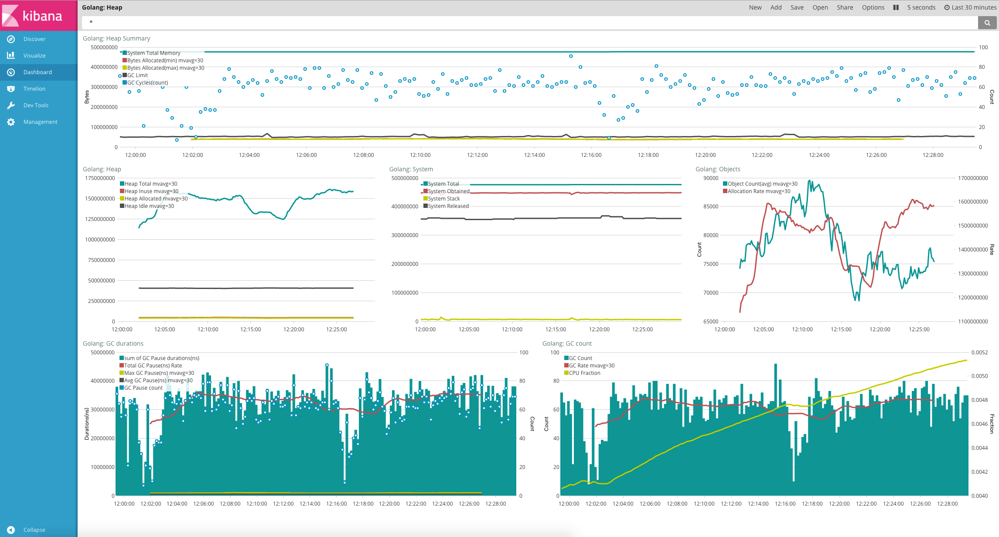

## 使用 Elastic Stack 来监控和调优 Golang 应用程序

Golang 因为其语法简单，上手快且方便部署正被越来越多的开发者所青睐，一个 Golang 程序开发好了之后，势必要关心其运行情况，今天在这里就给大家介绍一下如果使用 Elastic Stack 来分析 Golang 程序的内存使用情况，方便对 Golang 程序做长期监控进而调优和诊断，甚至发现一些潜在的内存泄露等问题。
 
Elastic Stack 其实是一个集合，包含 Elasticsearch、Logstash 和 Beats 这几个开源软件，而 Beats 又包含 Filebeat、Packetbeat、Winlogbeat、Metricbeat 和新出的 Heartbeat，呵呵，有点多吧，恩，每个 beat 做的事情不一样，没关系，今天主要用到 Elasticsearch、Metricbeat 和 Kibana 就行了。
 
Metricbeat 是一个专门用来获取服务器或应用服务内部运行指标数据的收集程序，也是 Golang 写的，部署包比较小才10M 左右，对目标服务器的部署环境也没有依赖，内存资源占用和 CPU 开销也较小，目前除了可以监控服务器本身的资源使用情况外，还支持常见的应用服务器和服务，目前支持列表如下：

- Apache Module
- Couchbase Module
- Docker Module
- HAProxy Module
- kafka Module
- MongoDB Module
- MySQL Module
- Nginx Module
- PostgreSQL Module
- Prometheus Module
- Redis Module
- System Module
- ZooKeeper Module

当然，也有可能你的应用不在上述列表，没关系，Metricbeat 是可以扩展的，你可以很方便的实现一个模块，而本文接下来所用的 Golang Module 也就是我刚刚为 Metricbeat 添加的扩展模块，目前已经 merge 进入 Metricbeat 的 master 分支，预计会在 6.0 版本发布，想了解是如何扩展这个模块的可以查看 代码路径 和 PR地址。
 
上面的这些可能还不够吸引人，我们来看一下 Kibana 对 Metricbeat 使用 Golang 模块收集的数据进行的可视化分析吧：



上面的图简单解读一下:
最上面一栏是 Golang Heap 的摘要信息，可以大致了解 Golang 的内存使用和 GC 情况，System 表示 Golang 程序从操作系统申请的内存，可以理解为进程所占的内存（注意不是进程对应的虚拟内存），Bytes allocated 表示 Heap 目前分配的内存，也就是 Golang 里面直接可使用的内存，GC limit 表示当 Golang 的 Heap 内存分配达到这个 limit 值之后就会开始执行 GC，这个值会随着每次 GC 而变化， GC cycles 则代表监控周期内的 GC 次数；
 
中间的三列分别是堆内存、进程内存和对象的统计情况；Heap Allocated 表示正在用和没有用但还未被回收的对象的大小；Heap Inuse 显然就是活跃的对象大小了；Heap Idle 表示已分配但空闲的内存；

底下两列是 GC 时间和 GC 次数的监控统计，CPUFraction 这个代表该进程 CPU 占用时间花在 GC 上面的百分比，值越大说明 GC 越频繁，浪费更多的时间在 GC 上面，上图虽然趋势陡峭，但是看范围在0.41%~0.52%之间，看起来还算可以，如果GC 比率占到个位数甚至更多比例，那肯定需要进一步优化程序了。
 
有了这些信息我们就能够知道该 Golang 的内存使用和分配情况和 GC 的执行情况，假如要分析是否有内存泄露，看内存使用和堆内存分配的趋势是否平稳就可以了，另外 GC_Limit 和 Byte Allocation 一直上升，那肯定就是有内存泄露了，结合历史信息还能对不同版本/提交对 Golang 的内存使用和 GC 影响进行分析。

接下来就要给大家介绍如何具体使用了，首先需要启用 Golang 的 expvar 服务，expvar（[https://golang.org/pkg/expvar/](https://golang.org/pkg/expvar/)） 是 Golang 提供的一个暴露内部变量或统计信息的标准包。
使用的方法很简单，只需要在 Golang 的程序引入该包即可，它会自动注册现有的 http 服务上，如下：

```go
import _ "expvar"
```

如果 Golang 没有启动 http 服务，使用下面的方式启动一个即可，这里端口是 6060，如下：

```go
func metricsHandler(w http.ResponseWriter, r *http.Request) {
	w.Header().Set("Content-Type", "application/json; charset=utf-8")

	first := true
	report := func(key string, value interface{}) {
		if !first {
			fmt.Fprintf(w, ",\n")
		}
		first = false
		if str, ok := value.(string); ok {
			fmt.Fprintf(w, "%q: %q", key, str)
		} else {
			fmt.Fprintf(w, "%q: %v", key, value)
		}
	}

	fmt.Fprintf(w, "{\n")
	expvar.Do(func(kv expvar.KeyValue) {
		report(kv.Key, kv.Value)
	})
	fmt.Fprintf(w, "\n}\n")
}

func main() {
   mux := http.NewServeMux()
   mux.HandleFunc("/debug/vars", metricsHandler)
   endpoint := http.ListenAndServe("localhost:6060", mux)
}
```

默认注册的访问路径是/debug/vars， 编译启动之后，就可以通过 [http://localhost:6060/debug/vars](http://localhost:6060/debug/vars)  来访问 expvar 以 JSON 格式暴露出来的这些内部变量，默认提供了 Golang 的 runtime.Memstats 信息，也就是上面分析的数据源，当然你还可以注册自己的变量，这里暂时不提。
 
OK，现在我们的 Golang 程序已经启动了，并且通过 expvar 暴露出了运行时的内存使用情况，现在我们需要使用 Metricbeat 来获取这些信息并存进 Elasticsearch。
 
关于 Metricbeat 的安装其实很简单，下载对应平台的包解压（下载地址：[https://www.elastic.co/downloads/beats/metricbeat](https://www.elastic.co/downloads/beats/metricbeat) ），启动 Metricbeat 前，修改配置文件：metricbeat.yml

```yaml
metricbeat.modules:
  - module: golang
     metricsets: ["heap"]
     enabled: true
     period: 10s
     hosts: ["localhost:6060"]
     heap.path: "/debug/vars"
```

上面的参数启用了 Golang 监控模块，并且会10秒获取一次配置路径的返回内存数据，我们同样配置该配置文件，设置数据输出到本机的 Elasticsearch：

```yaml
output.elasticsearch:
  hosts: ["localhost:9200"]
```

现在启动 Metricbeat：

```yaml
./metricbeat -e -v
```

现在在 Elasticsearch 应该就有数据了，当然记得确保 Elasticsearch 和 Kibana 是可用状态，你可以在 Kibana 根据数据灵活自定义可视化，推荐使用 Timelion 来进行分析，当然为了方便也可以直接导入提供的样例仪表板，就是上面第一个图的效果。
关于如何导入样例仪表板请参照这个文档：https://www.elastic.co/guide/e ... .html 
 
除了监控已经有的内存信息之外，如果你还有一些内部的业务指标想要暴露出来，也是可以的，通过 expvar 来做同样可以。一个简单的例子如下：

```yaml
var inerInt int64 = 1024
pubInt := expvar.NewInt("your_metric_key")
pubInt.Set(inerInt)
pubInt.Add(2)
```

在 Metricbeat 内部也同样暴露了很多内部运行的信息，所以 Metricbeat 可以自己监控自己了。。。
首先，启动的时候带上参数设置pprof监控的地址，如下：

```shell
./metricbeat -httpprof="127.0.0.1:6060" -e -v
```

这样我们就能够通过 [http://127.0.0.1:6060/debug/vars](http://127.0.0.1:6060/debug/vars) 访问到内部运行情况了，如下：

```
{
"output.events.acked": 1088,
"output.write.bytes": 1027455,
"output.write.errors": 0,
"output.messages.dropped": 0,
"output.elasticsearch.publishEvents.call.count": 24,
"output.elasticsearch.read.bytes": 12215,
"output.elasticsearch.read.errors": 0,
"output.elasticsearch.write.bytes": 1027455,
"output.elasticsearch.write.errors": 0,
"output.elasticsearch.events.acked": 1088,
"output.elasticsearch.events.not_acked": 0,
"output.kafka.events.acked": 0,
"output.kafka.events.not_acked": 0,
"output.kafka.publishEvents.call.count": 0,
"output.logstash.write.errors": 0,
"output.logstash.write.bytes": 0,
"output.logstash.events.acked": 0,
"output.logstash.events.not_acked": 0,
"output.logstash.publishEvents.call.count": 0,
"output.logstash.read.bytes": 0,
"output.logstash.read.errors": 0,
"output.redis.events.acked": 0,
"output.redis.events.not_acked": 0,
"output.redis.read.bytes": 0,
"output.redis.read.errors": 0,
"output.redis.write.bytes": 0,
"output.redis.write.errors": 0,
"beat.memstats.memory_total": 155721720,
"beat.memstats.memory_alloc": 3632728,
"beat.memstats.gc_next": 6052800,
"cmdline": ["./metricbeat","-httpprof=127.0.0.1:6060","-e","-v"],
"fetches": {"system-cpu": {"events": 4, "failures": 0, "success": 4}, "system-filesystem": {"events": 20, "failures": 0, "success": 4}, "system-fsstat": {"events": 4, "failures": 0, "success": 4}, "system-load": {"events": 4, "failures": 0, "success": 4}, "system-memory": {"events": 4, "failures": 0, "success": 4}, "system-network": {"events": 44, "failures": 0, "success": 4}, "system-process": {"events": 1008, "failures": 0, "success": 4}},
"libbeat.config.module.running": 0,
"libbeat.config.module.starts": 0,
"libbeat.config.module.stops": 0,
"libbeat.config.reloads": 0,
"memstats": {"Alloc":3637704,"TotalAlloc":155
... ...
```

比如，上面就能看到output模块Elasticsearch的处理情况，如 output.elasticsearch.events.acked 参数表示发送到 Elasticsearch Ack返回之后的消息。
 
现在我们要修改 Metricbeat 的配置文件，Golang 模块有两个 metricset，可以理解为两个监控的指标类型，我们现在需要加入一个新的 expvar 类型，这个即自定义的其他指标，相应配置文件修改如下：


```yaml
- module: golang
  metricsets: ["heap","expvar"]
  enabled: true
  period: 1s
  hosts: ["localhost:6060"]
  heap.path: "/debug/vars"
  expvar:
    namespace: "metricbeat"
    path: "/debug/vars"
```

上面的一个参数 namespace 表示自定义指标的一个命令空间，主要是为了方便管理，这里是 Metricbeat 自身的信息，所以 namespace 就是 metricbeat。
 
重启 Metricbeat 应该就能收到新的数据了，我们前往 Kibana。
 
这里假设关注 output.elasticsearch.events.acked和
output.elasticsearch.events.not_acked这两个指标，我们在Kibana里面简单定义一个曲线图就能看到 Metricbeat 发往 Elasticsearch 消息的成功和失败趋势。
Timelion 表达式：

```shell
.es("metricbeat*",metric="max:golang.metricbeat.output.elasticsearch.events.acked").derivative().label("Elasticsearch Success"),.es("metricbeat*",metric="max:golang.metricbeat.output.elasticsearch.events.not_acked").derivative().label("Elasticsearch Failed")
```

效果如下：


从上图可以看到，发往 Elasticsearch 的消息很稳定，没有出现丢消息的情况，同时关于 Metricbeat 的内存情况，我们打开导入的 Dashboard 查看:
 
 
 
 
 关于如何使用 Metricbeat 来监控 Golang 应用程序的内容基本上就差不多到这里了，上面介绍了如何基于 expvar 来监控 Golang 的内存情况和自定义业务监控指标，在结合 Elastic Stack 可以快速的进行分析，希望对大家有用。
 
 最后，这个 Golang 模块目前还没 release，估计在 beats 6.0 发布，有兴趣尝鲜的可以自己下载源码打包。
 
 **原文:[使用 Elastic Stack 来监控和调优 Golang 应用程序](https://my.oschina.net/u/569210/blog/852351)**